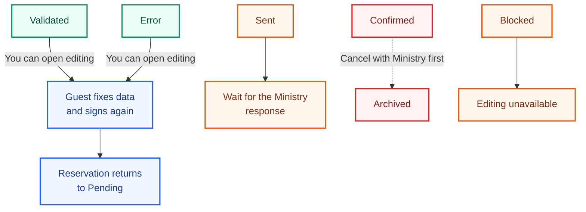

::: info Reference translation
This page is a courtesy translation. The [Spanish version](/guia/desbloquear-edicion-huesped) is the authoritative reference.
:::

# Admin edit-lock override

By default, as soon as you **validate** a reservation or the Ministry **rejects** it with an Error, guests can no longer edit their data. This prevents them from changing anything between your review and the Ministry submission.

But sometimes that's exactly what you need: a guest correcting their document number because the Ministry returned an Error. For that case, RegistroViajero lets you **unlock guest editing** without filing a cancellation.

## When you can unlock

You can flip the **Guest editing** switch only in these states:

- **Validated** — you have validated the reservation but haven't submitted it yet.
- **Error** — the Ministry has rejected the submission.

In the rest of the states (**Sent**, **Confirmed**, **Archived**, **Blocked**), the only way to modify the data is to file a **cancellation** with the Ministry first.

## How to unlock

1. Open the reservation.
2. Toggle **Guest editing** on.
3. Share the check-in link again with the guest.
4. The guest clicks **Edit my information** on the final check-in screen.
5. On click, the reservation auto-resets to **Pending** and the previous signature is deleted.
6. The guest fixes the data and signs again.
7. You validate and resubmit to the Ministry.

::: tip Team alerts
Every time a guest reopens editing, the team receives a **Guest reopened editing** notification. Handy when several members manage the agency.
:::

## What if I lock editing at the same time?

If you lock editing from the panel **at the same time** the guest is clicking **Edit my information**, RegistroViajero detects the conflict and shows the guest a message asking them to contact you. Your locking action prevails.

## Difference from a cancellation

- **Unlock editing** — only in **Validated** or **Error**. Not sent to the Ministry. The reservation goes back to **Pending**.
- **Cancellation** — for reservations already in **Confirmed**. Sent to the Ministry. The reservation moves to **Archived** and to register those guests again you must create a new reservation.

## Best practices

- If the Ministry returns an Error with a specific field, unlock editing and ask the guest to correct only that field.
- Don't unlock at midnight without warning the guest — the "editing unlocked" visual cue may confuse them if they don't know why you're asking them back to the link.
- If you're unsure whether a fix requires cancellation, check the [reservation state](/en/reference/states): as long as it isn't in **Sent**, **Confirmed**, **Archived**, or **Blocked**, you can edit without cancelling.
