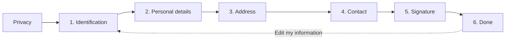

::: info Reference translation
This page is a courtesy translation. The [Spanish version](/guia/check-in) is the authoritative reference.
:::

# Check-in link

Each guest receives a **unique link** to complete their registration. They don't need to sign up, install anything, or download anything — they open the link on their phone or browser and fill in their data directly.

## How it works

1. From the reservation, click **Add guest**.
2. A **unique link** and a **QR code** are generated for each guest.
3. Share via WhatsApp, email, SMS, or any other channel. The QR is handy at the front desk.
4. You can also generate a **group link** that bundles every guest of a reservation on a single page — ideal for sending just one message to the lead guest. See [Group check-in](/en/guide/group-check-in).

## Privacy screen

Before the first step, the guest sees an information screen on data privacy and Royal Decree 933/2021. They must accept before continuing — the acceptance is timestamped.

## The 6 steps of the form

1. **Identification** — nationality, document type, document number, and support number when applicable.
2. **Personal details** — first name, surname(s), sex, date of birth. Ages 14–17: kinship with an adult on the same reservation.
3. **Address** — street, postal code, city, country, municipality, province.
4. **Contact** — phone with international prefix and/or email.
5. **Signature** — declaration of accuracy and the guest's handwritten signature.
6. **Done** — summary of the submitted data and, if the reservation is not locked, an **Edit my information** button to reopen editing.

::: info
Data is saved as soon as the guest moves to the next step. If they close the browser mid-step, that step is not saved until they advance; previously completed steps are kept when they reopen the link.
:::

## Document rules

| Document | Last name 2? | Support number? |
| --- | --- | --- |
| DNI | Yes | Yes |
| Passport | No | No |
| NIE | Yes | Yes |
| EU registration certificate | No | Yes |
| Foreign national ID | No | No |
| Travel document | No | No |

::: tip
The **DNI support number** is the alphanumeric code printed on the back of the card (DNI 3.0 cards print it next to the CAN).
:::

::: warning No document photos required
RegistroViajero **does not** ask for photos of the DNI or passport. Only textual data is collected (type, number, and support number when applicable). If you need to keep ID copies for internal reasons, do so outside the platform.
:::

## Soft data-quality warnings

While the guest fills in the form, RegistroViajero shows **non-blocking warnings** when it detects likely typos:

- Street that's too short (probably incomplete).
- Postal code with the wrong length for the country.
- Suspicious-looking email format.
- Recommended optional fields left blank.

These are advisory — the guest can move on. Only the **Ministry's hard requirements** block the signature step:

- Age 14 or older (under-14s are exempt from full registration).
- Last name 2 if the document is DNI or NIE.
- Support number if the document is DNI, NIE, or EU certificate.

More detail in [Data-quality warnings](/en/guide/data-quality-warnings).

## Minors

- **Under 14:** exempt from registration under Royal Decree 933/2021. They do not sign and no document is collected.
- **14 to 17:** complete the form and declare their **kinship** with an adult on the same reservation (son/daughter, sibling, etc.).

## Returning-guest prefill

If a guest stays again and opens a new link with the **same document number**, RegistroViajero detects their previous data and offers to reuse it with a single click. The guest reviews, edits anything that has changed, and signs — without re-typing.

## Available languages

The check-in form is available in **9 languages**: Spanish, English, French, German, Italian, Portuguese, Galician, Basque, and Catalan. The locale is auto-detected from the guest's browser, and from the admin panel you can pre-configure the link's language.

## Editing after signing

On the final step (**Done**) the guest sees an **Edit my information** button, shown while the reservation is not locked. Clicking it:

- Deletes their signature.
- Sends the reservation back to **Pending**.
- Notifies you that a guest has reopened their edit.

If too much time has passed and you have just locked editing from the panel, the guest sees a message asking them to contact you.
