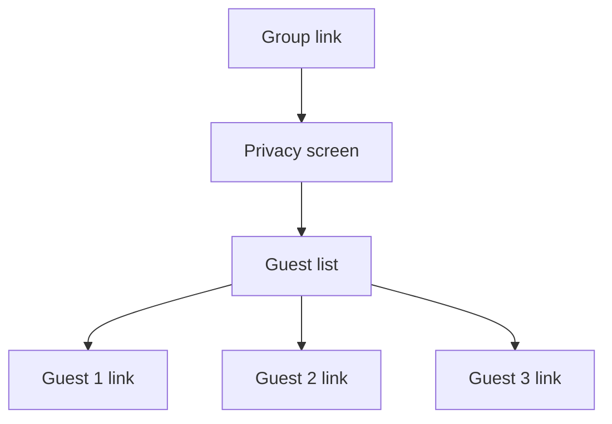

::: info Reference translation
This page is a courtesy translation. The [Spanish version](/guia/check-in-grupal) is the authoritative reference.
:::

# Group check-in

When a reservation has several guests, instead of messaging each one separately, you can share **a single group link** that opens a page with all the individual check-in links of the reservation.

## When to use it

- Families with several members and a single contact (the lead guest).
- Groups of friends where one person handles everything.
- Reservations where you only have the lead guest's contact.

## How to generate it

1. Open the reservation.
2. Click **Group link** (next to the individual links).
3. Share the link or the QR code via WhatsApp, email, SMS, etc.

## What the guest sees

The lead guest opens the group link and sees:

- A short intro and the Royal Decree 933/2021 privacy screen.
- The **list of guests** on the reservation, with a **Complete my data** button per guest.
- A QR code per guest, handy if the others are with them in person.

Each guest taps their button and completes the regular [check-in form](/en/guide/check-in).

## Progress status

The group page shows **each guest's status** in real time (Pending, In progress, Completed). The lead guest can see at a glance who still needs to sign.

## What if I add a guest later?

When you add a guest to the reservation after generating the group link, the group page reflects it automatically the next time it's opened — no need to regenerate the link.

## Languages

The group page follows the same rules as the [individual link](/en/guide/check-in): the locale is auto-detected from the browser and guests can switch it from a selector. Available in 9 languages.

## Privacy

The group link **does not expose data** of guests who have already completed — it only shows their name (if entered) and their status. Sensitive data (document, address, etc.) is never visible from the group link.
