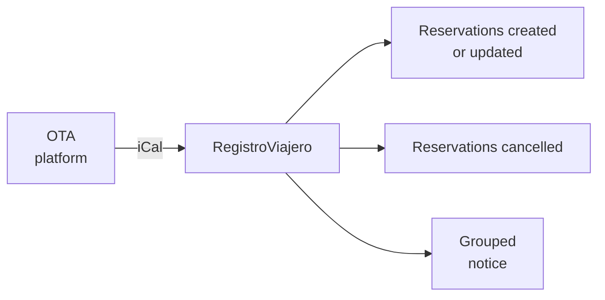

::: info Reference translation
This page is a courtesy translation. The [Spanish version](/guia/ical) is the authoritative reference.
:::

# Import calendars (iCal)

Connect your booking platform calendars to auto-import reservations and keep your accommodations in sync with the OTAs.

## Supported platforms

- Booking.com
- Airbnb
- VRBO
- Expedia
- Tripadvisor
- Google Calendar
- Holidu
- Rentalia
- Any other platform that exports iCal calendars (`.ics`)

## How to connect a calendar

1. Go to your accommodation in RegistroViajero.
2. In the **Calendar feeds** section, click **Add feed**.
3. Pick the platform and paste the iCal export URL.
4. RegistroViajero validates the connection immediately and performs the first sync.

::: tip
You can connect several platforms to a single accommodation. Each feed syncs independently and can be enabled or disabled separately.
:::

## Sync

- **Automatic** every **15 minutes**.
- **Manual** available at any time from the feeds section.
- When changes happen, you receive **a single grouped notice** per cycle and agency, not one per platform.

## Imported reservations

Imported reservations show a visual indicator of their origin (Booking.com, Airbnb, etc.).

Platforms that don't include guest data in the calendar create reservations with no guests. Some, like Airbnb, do include the guest's first name (e.g., "Airbnb: John") which is used as the reference. From the reservation you can:

- **Add guests** and send their check-in links.
- **Block the dates** if you don't need guest registration.

## Automatic cancellations

If a reservation disappears from the feed (because the guest cancelled in the OTA), RegistroViajero marks it as **Cancelled** on the next sync.

::: tip Reactivate a cancellation
If the cancellation was a mistake and you want the reservation back, open it and hit **Reactivate**. RegistroViajero unlinks it from the feed so it won't be re-cancelled on the next sync. More detail in [Reactivate a reservation](/en/guide/reactivate-cancelled-booking).
:::

## Enable and disable feeds

Each feed has an **active/inactive** switch. Disabling a feed pauses syncing while keeping previously imported data. Useful for diagnosing conflicts without losing reservations.

## Where to find the iCal URL

### Booking.com
Extranet → Property → Calendar sync → Export calendar.

### Airbnb
Calendar → Availability → Export calendar → Copy link.

### VRBO
Calendar → Import/Export → Export calendar.

### Holidu / Rentalia / other platforms
Look for the **Export calendar** option in the calendar settings and copy the URL ending in `.ics`.

### Google Calendar
Calendar settings → **Integrate calendar** → Secret address in iCal format.
