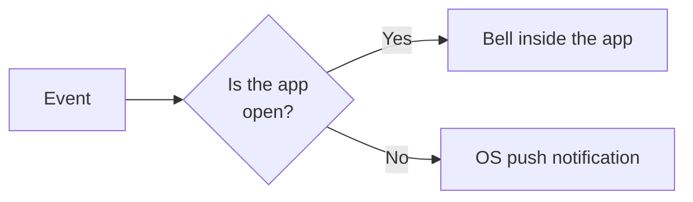

::: info Reference translation
This page is a courtesy translation. The [Spanish version](/guia/notificaciones) is the authoritative reference.
:::

# Notifications

RegistroViajero keeps you informed about activity on your reservations and team. Delivery is **smart**: if you have the app open, you get the notification inside the app; if not, it arrives as an operating-system notification. You never get both for the same event.

## Notification types

| Type | When it fires |
|---|---|
| **Guest completed check-in** | A guest has finished every step and signed. |
| **Guest reopened editing** | A guest has clicked **Edit my information** after completing — the reservation goes back to Pending. |
| **Ministry confirmation** | The Ministry has accepted the submission. |
| **Ministry error** | The Ministry has rejected the submission. |
| **New team member** | Someone has accepted a team invitation. |
| **Reservation created** | A new reservation was created (manually or imported via iCal). |

## Channels

### Inside the app

Shown in the **bell** icon of the admin panel. They are grouped by reservation: several actions on the same reservation appear as a single grouped entry. Marking a grouped entry as read marks them all.

### OS push

If you install the app on your device (see [Install the app](/en/guide/install-as-app)), you can receive operating-system push notifications even when the app is not open. On iOS, push only works once the app is installed to the home screen.

::: warning Brave blocks push
Push notifications do not work in **Brave** because of its privacy restrictions. Use Chrome or Edge if you need push.
:::

## How duplicates are avoided

Each event is delivered through **a single channel**. If you have the app open in a tab, notifications appear in the bell and never duplicate as OS push.

## Grouping

Related notifications are grouped. For example, if three guests on the same reservation sign back-to-back, you'll see one grouped entry in the bell instead of three. If a more recent event comes in for the same reservation (for instance, a guest reopening their edits), the previous entries un-group so you can see the change.

## Preferences

In **Settings → Notifications** you can toggle each notification type **independently**. Disabling **Guest completed check-in** does not affect **Guest reopened editing** or any other type. New types are enabled by default when introduced.

Each user manages their own preferences — they are not agency-wide.

## Automatic cleanup

- Notifications are automatically deleted after **30 days**.
- OS push subscriptions that have not been used for **90 days** are removed from the server.

This cleanup runs in the background; no action is required.
