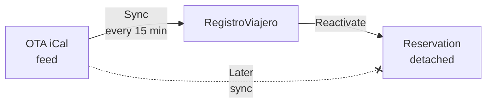

::: info Reference translation
This page is a courtesy translation. The [Spanish version](/guia/reactivar-reserva) is the authoritative reference.
:::

# Reactivate a cancelled reservation

If a reservation is cancelled by mistake — by you, by an iCal sync from an OTA, or after a Ministry cancellation — you can **reactivate** it without recreating it from scratch.

## When to use Reactivate

- The OTA cancelled the reservation by accident and the guest is still staying.
- You manually cancelled a reservation in error and the guest is arriving that night.
- After a cancellation to the Ministry, you're starting over with corrected data.

## How to reactivate

1. Open the cancelled reservation (in the **Reservations** list, filter by state **Cancelled**).
2. Hit **Reactivate**.
3. The reservation returns to an active state:
   - **Pending** if guest data is still incomplete.
   - **Guest completed** if all guests had signed before the cancellation.

## What happens with the iCal feed

If the reservation was imported from an iCal calendar (Booking, Airbnb, etc.) and the next sync would still detect it as cancelled at the OTA, **RegistroViajero would re-cancel it** automatically.

To break that loop, **reactivating detaches the reservation from the source iCal feed**:

- The reservation keeps a visible note about its origin (Booking, Airbnb, etc.) for your reference.
- But subsequent syncs **no longer affect it** — it won't be cancelled again, and it won't be updated with date changes.
- From that point on, the reservation is fully manual: if the dates change at the OTA, you'll have to update them by hand.

::: warning
If the cancellation came from a **Ministry-side cancellation**, reactivating the reservation in RegistroViajero **does not reactivate it with the Ministry**. You'll need to send a new submission with the corrected data.
:::

## After reactivating

Once reactivated:

- The **guest editing** switch returns to its default value based on the [state](/en/reference/states).
- Previous guest signatures are kept if the reservation moves to **Guest completed**.
- If you reactivate it as **Pending**, guests can edit their data again.

More detail in [Reservation states](/en/reference/states).
