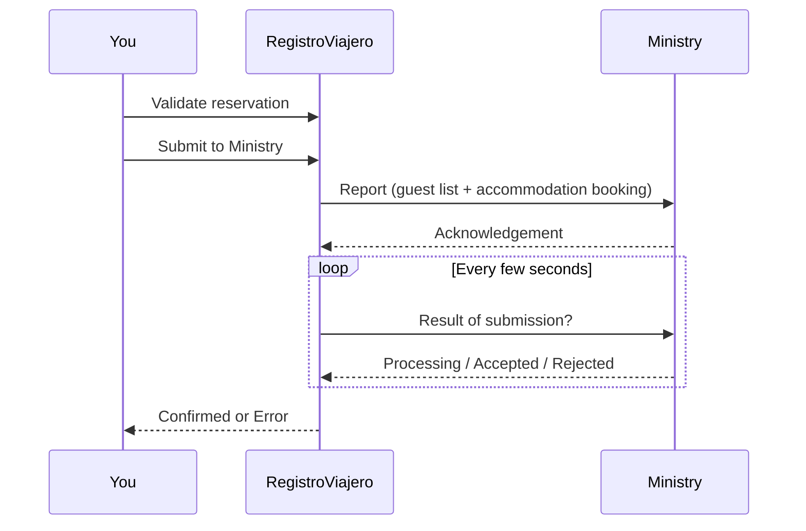

::: info Reference translation
This page is a courtesy translation. The [Spanish version](/guia/enviar) is the authoritative reference.
:::

# Validate and submit

Once all guests on a reservation have completed their data, you can validate and submit the report to the Ministry of the Interior.

## Submission flow

1. **Review** — check that every guest's data is correct.
2. **Validate** — mark the reservation as validated. This confirms you have reviewed the data.
3. **Submit** — with one click, RegistroViajero prepares the documents and sends them to SES.HOSPEDAJES.
4. **Wait for the result** — the Ministry may take a few seconds to respond. RegistroViajero polls automatically and notifies you when there's news.

## What is submitted

For each stay, two documents are sent:

- **Guest list (parte de viajeros)** — data on every guest staying.
- **Accommodation booking (reserva de hospedaje)** — data on the accommodation and the booking.

You don't have to prepare anything — RegistroViajero generates them from the data it already has.

## Possible outcomes

- **Confirmed** — the Ministry has accepted the report. Nothing else to do.
- **Error** — the Ministry has rejected some data. See [Ministry errors](/en/reference/ses-errors) to identify the field to fix.

::: info Duplicate resubmissions
If a network blip causes RegistroViajero to send the same report twice, the Ministry detects the duplicate and RegistroViajero automatically recovers the response from the first submission. No action needed.
:::

## Fix a rejected submission (without cancelling)

Unlike **Sent** or **Confirmed**, an **Error** state **does not lock** the reservation. You can:

1. Open the reservation.
2. Click **Guest editing** to unlock guest editing.
3. Ask the guest to correct the data (or correct it yourself).
4. Validate again and resubmit.

No prior Ministry cancellation is needed — the new submission replaces the previous attempt.

## Cancellation

If a reservation is already **Confirmed** and you need to cancel it with the Ministry (because the guest or the OTA cancelled), use the **Cancel** option on the reservation. RegistroViajero sends a cancellation to SES.HOSPEDAJES and the reservation moves to **Cancelled**.

## Prerequisites

To submit to the Ministry you need:

- Configured [SES credentials](/en/guide/ses-credentials).
- An **establishment code** assigned to the accommodation.
- All guests with completed data and signatures.
- Active Pro subscription (or trial in progress).

::: warning Locked reservations
Once in **Sent** or **Confirmed**, guests cannot keep editing. If you need to correct data on a **Confirmed** reservation, first send a **cancellation** and start over.
:::
