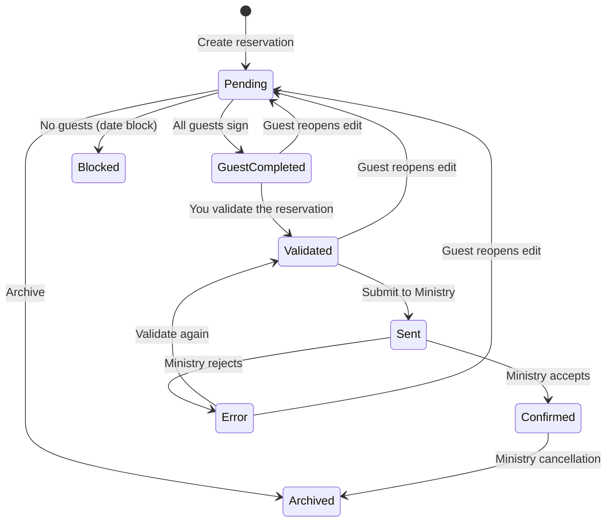

::: info Reference translation
This page is a courtesy translation. The [Spanish version](/referencia/estados) is the authoritative reference.
:::

# Reservation states

Every reservation moves through a set of states reflecting its progress from creation to Ministry confirmation. Independent of the state, there is a separate **guest-edit** switch that controls whether guests can modify their data.

## State diagram

## Reservation states

| State | Description |
|--------|-------------|
| **Pending** | Reservation created. Waiting for guests to complete their data. |
| **Guest completed** | All guests have filled in and signed. Ready for you to validate. |
| **Validated** | You have reviewed the data. Ready to submit to the Ministry. |
| **Sent** | The submission has been sent to SES.HOSPEDAJES. Awaiting response. |
| **Confirmed** | The Ministry has accepted the submission. |
| **Error** | The Ministry has rejected the submission. See [SES errors](/en/reference/ses-errors). |
| **Archived** | The reservation is no longer active (you archived it, the OTA cancelled it through iCal, or a Ministry cancellation was filed). |
| **Blocked** | Date block with no guests (maintenance, personal use, etc.). |

## Guest states

Each individual guest has their own state:

| State | Description |
|--------|-------------|
| **Pending** | Link generated, not yet opened. |
| **Link opened** | The guest has opened the link at least once. |
| **In progress** | The guest has started filling in and saved at least one step. |
| **Completed** | The guest has completed every step and signed. |

The reservation moves to **Guest completed** once **all** guests reach the **Completed** state.

## Registration lock

States in which the reservation is **immutable** — you cannot add or remove guests, and the dates cannot change:

- **Sent**
- **Confirmed**
- **Archived**
- **Blocked**

In **Pending**, **Guest completed**, **Validated**, and **Error** the reservation remains editable.

## Guest-edit lock

Independent of the reservation state, a separate switch controls whether guests can edit their data:

| State | Guest editing by default |
|---|---|
| **Pending** | Open (guests can edit) |
| **Guest completed** | Open |
| **Validated** | Locked |
| **Error** | Locked |
| **Sent** | Locked |
| **Confirmed** | Locked |
| **Archived** | Locked |
| **Blocked** | Locked |

### Manual unlock

Only in **Validated** and **Error** can you unlock guest editing with one click, without filing a cancellation with the Ministry. This is the fastest way to fix data the Ministry has flagged.

When a guest hits **Edit my information**, the reservation auto-resets to **Pending**.

In the remaining states (**Sent**, **Confirmed**, **Archived**, **Blocked**) the switch is disabled — the only way to modify the data is to file a cancellation with the Ministry first.

More detail in [Admin edit-lock override](/en/guide/admin-edit-lock-override).
