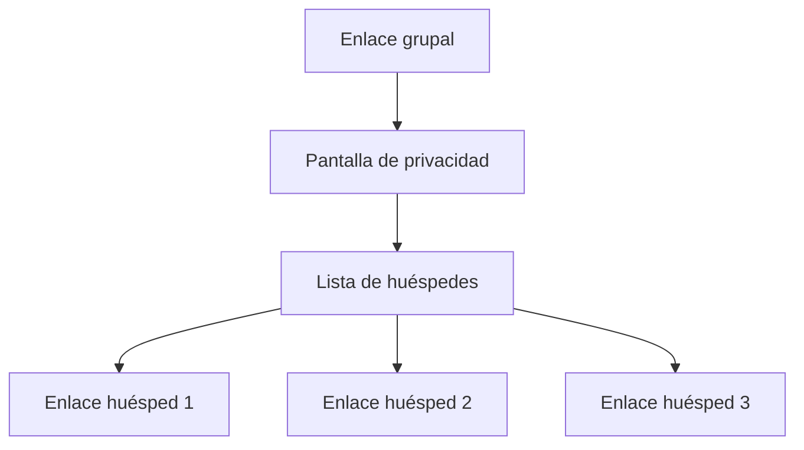

# Check-in en grupo

Cuando una reserva tiene varios huéspedes, en lugar de mandar un mensaje a cada uno, puedes compartir **un único enlace grupal** que abre una página con todos los enlaces individuales de la reserva.

## Cuándo usarlo

- Familias con varios miembros y un único contacto (el huésped principal).
- Grupos de amigos donde el organizador centraliza todo.
- Reservas en las que solo conoces el contacto del titular.

## Cómo generarlo

1. Abre la reserva.
2. Pulsa **Enlace grupal** (junto a los enlaces individuales).
3. Comparte el enlace o el código QR por WhatsApp, email, SMS, etc.

## Qué ve el huésped

El huésped principal abre el enlace grupal y ve:

- Una breve introducción y la pantalla de privacidad del RD 933/2021.
- La **lista de huéspedes** de la reserva con un botón **Completar mis datos** por cada uno.
- Un código QR por huésped, útil si los demás están con él en persona.

Cada huésped pulsa su botón y completa el [formulario de check-in](/guia/check-in) habitual.

## Estado del progreso

La página grupal muestra el **estado de cada huésped** en tiempo real (Pendiente, En progreso, Completado). El huésped principal puede ver de un vistazo a quién le falta firmar.

## ¿Y si añado un huésped después?

Cuando añades un huésped a la reserva después de generar el enlace grupal, la página grupal lo refleja automáticamente la próxima vez que se abre — no hace falta regenerar el enlace.

## Idiomas

La página grupal sigue las mismas reglas que el [enlace individual](/guia/check-in): se autodetecta el idioma a partir del navegador y los huéspedes pueden cambiarlo desde un selector. Disponible en 9 idiomas.

## Privacidad

El enlace grupal **no expone datos** de los huéspedes ya completados — solo muestra su nombre (si lo introdujeron) y su estado. Los datos sensibles (documento, dirección, etc.) nunca son visibles desde el enlace grupal.
