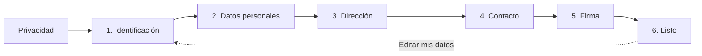

# Enlace de check-in

Cada huésped recibe un **enlace único** para completar su registro. No necesitan registrarse, instalar ninguna aplicación ni descargar nada — abren el enlace en su móvil o navegador y rellenan sus datos directamente.

## Cómo funciona

1. Desde la reserva, haz clic en **Añadir huésped**.
2. Se genera un **enlace único** y un **código QR** para cada huésped.
3. Compártelo por WhatsApp, email, SMS o cualquier otro medio. El QR es útil en recepción.
4. También puedes generar un **enlace grupal** con los enlaces de todos los huéspedes en una sola página, ideal para enviar al huésped principal de la reserva. Ver [Check-in en grupo](/guia/check-in-grupal).

## Pantalla de privacidad

Antes del primer paso, el huésped ve una pantalla de información sobre privacidad y el Real Decreto 933/2021. Tiene que aceptar antes de continuar — esa aceptación se guarda con marca de fecha y hora.

## Los 6 pasos del formulario

1. **Identificación** — nacionalidad, tipo de documento, número de documento y número de soporte cuando aplique.
2. **Datos personales** — nombre, apellido(s), sexo y fecha de nacimiento. De 14 a 17 años: parentesco con un adulto de la misma reserva.
3. **Dirección** — calle, código postal, ciudad, país, municipio y provincia.
4. **Contacto** — teléfono con prefijo internacional y/o email.
5. **Firma** — declaración de exactitud y firma manuscrita del huésped.
6. **Listo** — resumen de los datos enviados y, si la reserva no está bloqueada, un botón **Editar mis datos** para reabrir la edición.

::: info
Los datos se guardan en cuanto el huésped pasa al siguiente paso. Si cierra el navegador a mitad de un paso, ese paso no quedará guardado hasta que avance; los pasos completados antes sí se mantienen al reabrir el enlace.
:::

## Reglas de documentos

| Documento | ¿Apellido 2? | ¿Número de soporte? |
| --- | --- | --- |
| DNI | Sí | Sí |
| Pasaporte | No | No |
| NIE | Sí | Sí |
| Certificado de registro UE | No | Sí |
| Documento de identidad extranjero | No | No |
| Documento de viaje | No | No |

::: tip
El **número de soporte** del DNI es el código alfanumérico impreso en el reverso de la tarjeta (los DNI 3.0 lo llevan junto al CAN).
:::

::: warning No se piden fotos del documento
RegistroViajero **no requiere** subir fotos del DNI ni del pasaporte. Solo se piden los datos textuales (tipo, número y, cuando aplique, número de soporte). Si necesitas custodiar copias por motivos internos, hazlo fuera de la plataforma.
:::

## Avisos de calidad de datos

Mientras el huésped rellena, RegistroViajero le muestra **avisos no bloqueantes** cuando detecta posibles erratas:

- Calle muy corta (probablemente incompleta).
- Código postal con longitud incorrecta para el país.
- Email con formato sospechoso.
- Datos opcionales recomendados sin rellenar.

Estos avisos son orientativos — el huésped puede seguir adelante. Solo los **requisitos del Ministerio** bloquean la firma:

- Edad de 14 años o más (los menores de 14 están exentos del registro completo).
- Apellido 2 si el documento es DNI o NIE.
- Número de soporte si el documento es DNI, NIE o certificado UE.

Más detalle en [Avisos de calidad de datos](/guia/avisos-calidad-datos).

## Menores de edad

- **Menores de 14 años:** exentos del registro según el RD 933/2021. No firman, no se les pide documento.
- **De 14 a 17 años:** completan el formulario e indican el **parentesco** con un adulto de la misma reserva (hijo/a, hermano/a, etc.).

## Datos previos (autocompletado)

Si un huésped vuelve a hospedarse y abre un nuevo enlace con el **mismo número de documento**, RegistroViajero detecta sus datos anteriores y le ofrece reutilizarlos en un solo clic. El huésped revisa, ajusta lo que haya cambiado y firma — sin volver a teclear los datos.

## Idiomas disponibles

El formulario de check-in está disponible en **9 idiomas**: español, inglés, francés, alemán, italiano, portugués, gallego, euskera y catalán. Se autodetecta a partir del navegador del huésped, y desde el panel de administración puedes preconfigurar el idioma del enlace.

## Editar después de firmar

En el paso final (**Listo**) el huésped ve un botón **Editar mis datos**, visible mientras la reserva no esté bloqueada. Al pulsarlo:

- Se borra su firma.
- La reserva vuelve al estado **Pendiente**.
- Tú recibes un aviso de que un huésped ha reabierto su edición.

Si pasa demasiado tiempo y acabas de bloquear la edición desde el panel, el huésped ve un mensaje pidiéndole que contacte contigo.
