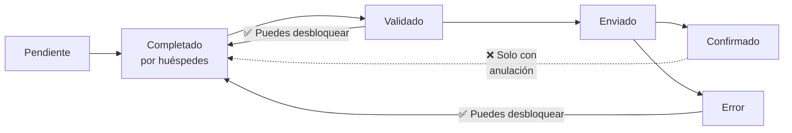

# Desbloquear edición del huésped

Por defecto, en cuanto **validas** una reserva o el Ministerio la **rechaza** con un Error, los huéspedes ya no pueden editar sus datos. Esto evita que cambien algo entre que tú revisas y que envías al Ministerio.

Pero a veces necesitas exactamente eso: que un huésped corrija su número de documento porque el Ministerio te lo ha devuelto en Error. Para ese caso, RegistroViajero te permite **desbloquear la edición** sin tener que enviar una anulación.

## Cuándo se puede desbloquear

Solo puedes activar el botón **Edición del huésped** en estos estados:

- **Validado** — has validado la reserva pero aún no la has enviado.
- **Error** — el Ministerio ha rechazado la comunicación.

En el resto de estados (**Enviado**, **Confirmado**, **Cancelado**, **Bloqueado**) la única forma de modificar los datos es enviar primero una **anulación** al Ministerio.

## Cómo desbloquear

1. Abre la reserva.
2. Pulsa **Edición del huésped** para abrir el interruptor.
3. Comparte de nuevo el enlace de check-in con el huésped (o usa tú su sesión).
4. El huésped pulsa **Editar mis datos** en la pantalla final del check-in.
5. Al pulsar, la reserva vuelve automáticamente a **Pendiente** y se borra su firma anterior.
6. El huésped corrige los datos y vuelve a firmar.
7. Tú validas y reenvías al Ministerio.

::: tip Avisos al equipo
Cada vez que un huésped reabre la edición, el equipo recibe el aviso **Huésped reabrió la edición**. Útil cuando varios miembros gestionan la agencia.
:::

## ¿Qué pasa si bloqueo la edición justo a la vez?

Si tú estás bloqueando la edición desde el panel **al mismo tiempo** que el huésped pulsa **Editar mis datos**, RegistroViajero detecta el conflicto y muestra al huésped un mensaje pidiéndole que contacte contigo. Tu acción de bloqueo prevalece.

## Diferencia con la anulación

- **Desbloquear edición** — solo en **Validado** o **Error**. No se comunica al Ministerio. La reserva vuelve a **Pendiente**.
- **Anulación** — para reservas ya **Confirmadas**. Sí se comunica al Ministerio. La reserva pasa a **Cancelado**, y para volver a registrar a esos huéspedes hay que crear una nueva reserva.

## Buenas prácticas

- Si el Ministerio te devuelve un Error con un campo específico, desbloquea la edición y pide al huésped que solo corrija ese dato.
- No desbloquees a media noche si no avisas al huésped — el aviso visual de "edición desbloqueada" puede confundirlo si no sabe por qué le pides volver al enlace.
- Si dudas si una corrección requiere anulación, mira el [estado de la reserva](/referencia/estados): mientras no esté en **Enviado**, **Confirmado**, **Cancelado** o **Bloqueado**, puedes editar sin anular.
