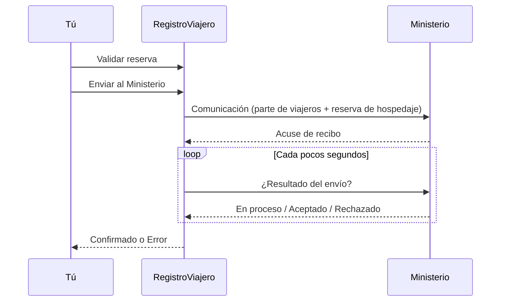

# Validar y enviar

Una vez que todos los huéspedes de una reserva han completado sus datos, puedes validar y enviar la comunicación al Ministerio del Interior.

## Flujo de envío

1. **Revisar** — comprueba que los datos de todos los huéspedes son correctos.
2. **Validar** — marca la reserva como validada. Confirma que has revisado los datos.
3. **Enviar** — con un clic, RegistroViajero prepara los documentos y los envía a SES.HOSPEDAJES.
4. **Espera el resultado** — el Ministerio puede tardar unos segundos en responder. RegistroViajero consulta el estado automáticamente y te avisa cuando hay novedades.

## Qué se envía

Por cada estancia se envían dos documentos:

- **Parte de viajeros** — datos de todos los huéspedes que se alojan.
- **Reserva de hospedaje** — datos del alojamiento y de la reserva.

Tú no tienes que preparar nada — RegistroViajero los genera con los datos que ya tiene.

## Resultados posibles

- **Confirmado** — el Ministerio ha aceptado la comunicación. No hace falta más.
- **Error** — el Ministerio ha rechazado algún dato. Ver [errores del Ministerio](/referencia/errores-ses) para identificar el campo a corregir.

::: info Reenvíos duplicados
Si por una incidencia de red RegistroViajero acaba enviando dos veces la misma comunicación, el Ministerio detecta el duplicado y RegistroViajero recupera automáticamente la respuesta del primer envío. No tienes que hacer nada.
:::

## Corregir un envío rechazado (sin anular)

A diferencia del estado **Enviado** o **Confirmado**, un envío en **Error** **no bloquea** la reserva. Puedes:

1. Abrir la reserva.
2. Pulsar **Edición del huésped** para desbloquear la edición.
3. Pedir al huésped que corrija los datos (o corregirlos tú).
4. Volver a validar y reenviar.

No hace falta una anulación previa al Ministerio — la nueva comunicación reemplaza al intento anterior.

## Anulación

Si una reserva ya está **Confirmada** y necesitas cancelarla en el Ministerio (porque la cancela el huésped o la OTA), usa la opción **Cancelar** en la reserva. RegistroViajero envía una anulación a SES.HOSPEDAJES y deja la reserva en estado **Cancelado**.

## Requisitos previos

Para enviar al Ministerio necesitas:

- [Credenciales SES](/guia/credenciales-ses) configuradas.
- **Código de establecimiento** asignado al alojamiento.
- Todos los huéspedes con datos completos y firma.
- Suscripción Pro activa (o periodo de prueba en curso).

::: warning Reservas bloqueadas
Una vez en estado **Enviado** o **Confirmado**, los huéspedes no pueden seguir editando. Si necesitas corregir datos en **Confirmado**, primero envía una **anulación** y vuelve a empezar.
:::
