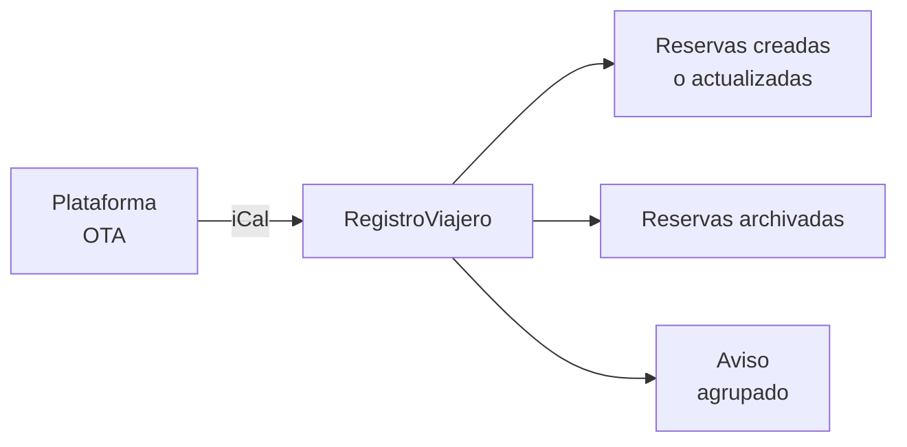

# Importar calendarios (iCal)

Conecta los calendarios de tus plataformas de reservas para importar reservas automáticamente y mantener tus alojamientos sincronizados con las OTAs.

## Plataformas compatibles

- Booking.com
- Airbnb
- VRBO
- Expedia
- Tripadvisor
- Google Calendar
- Holidu
- Rentalia
- Cualquier otra plataforma que exporte calendarios iCal (`.ics`)

## Cómo conectar un calendario

1. Ve a tu alojamiento en RegistroViajero.
2. En la sección **Feeds de calendario**, haz clic en **Añadir feed**.
3. Selecciona la plataforma y pega la URL de exportación iCal.
4. RegistroViajero valida la conexión inmediatamente y hace la primera sincronización.

::: tip
Puedes conectar varias plataformas a un mismo alojamiento. Cada feed se sincroniza de forma independiente y se puede activar o desactivar por separado.
:::

## Sincronización

- **Automática** cada **15 minutos**.
- **Manual** disponible en cualquier momento desde la sección de feeds.
- Cuando hay cambios, recibes **un único aviso agrupado** por ciclo y agencia, no uno por plataforma.

## Reservas importadas

Las reservas importadas aparecen con un indicador visual de su origen (Booking.com, Airbnb, etc.).

Las plataformas que no incluyen datos de huéspedes en el calendario crean reservas sin huéspedes. Algunas, como Airbnb, sí incluyen el nombre de pila del huésped (por ejemplo, "Airbnb: John") y se usa como referencia. Desde la reserva puedes:

- **Añadir huéspedes** y enviar los enlaces de check-in.
- **Bloquear las fechas** si no necesitas registro de huéspedes.

## Cancelaciones automáticas

Si una reserva desaparece del feed (porque el huésped la canceló en la OTA), RegistroViajero la marca como **Archivada** en el siguiente sync.

::: tip Reactivar una cancelación
Si la cancelación fue un error y quieres recuperar la reserva, ábrela y pulsa **Reactivar**. RegistroViajero la desvincula del feed para que no vuelva a archivarse en el siguiente sync. Más detalle en [Reactivar una reserva](/guia/reactivar-reserva).
:::

## Activar y desactivar feeds

Cada feed tiene un interruptor de **activo/inactivo**. Desactivar un feed pausa la sincronización pero mantiene los datos importados anteriormente. Útil para diagnosticar conflictos sin perder reservas.

## Dónde encontrar la URL iCal

### Booking.com
Extranet → Alojamiento → Sincronización de calendarios → Exportar calendario.

### Airbnb
Calendario → Disponibilidad → Exportar calendario → Copiar enlace.

### VRBO
Calendario → Importar/Exportar → Exportar calendario.

### Holidu / Rentalia / resto de plataformas
Busca la opción **Exportar calendario** en los ajustes de calendario y copia la URL terminada en `.ics`.

### Google Calendar
Ajustes del calendario → **Integrar calendario** → URL secreta en formato iCal.
