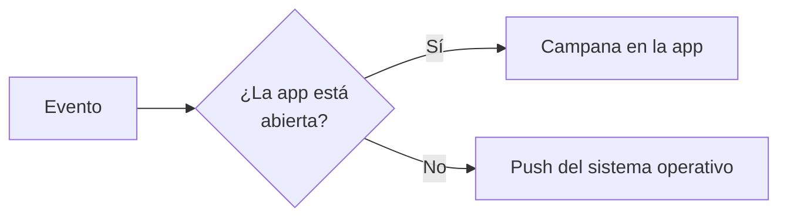

# Notificaciones

RegistroViajero te mantiene informado sobre la actividad de tus reservas y tu equipo. La entrega es **inteligente**: si tienes la app abierta, recibes la notificación dentro de la app; si no, llega como notificación del sistema operativo. Nunca llega por las dos vías a la vez.

## Tipos de notificación

| Tipo | Cuándo se dispara |
|---|---|
| **Huésped completó check-in** | Un huésped ha terminado todos los pasos y ha firmado. |
| **Huésped reabrió la edición** | Un huésped ha pulsado **Editar mis datos** después de completar — la reserva vuelve a Pendiente. |
| **Confirmación del Ministerio** | El Ministerio ha aceptado la comunicación. |
| **Error del Ministerio** | El Ministerio ha rechazado la comunicación. |
| **Nuevo miembro del equipo** | Alguien ha aceptado una invitación a tu equipo. |
| **Reserva creada** | Se ha creado una nueva reserva (manual o importada por iCal). |

## Canales

### Dentro de la app

Aparecen en el icono de **campana** del panel de administración. Se agrupan por reserva: varias acciones de la misma reserva se muestran como una sola entrada agrupada. Marcar como leída una entrada agrupada las marca todas.

### Push del sistema operativo

Si instalas la aplicación en tu dispositivo (ver [Instalar la app](/guia/instalar-pwa)), puedes recibir notificaciones push del sistema operativo aunque no tengas la app abierta. En iOS solo funciona si has instalado la app en la pantalla de inicio.

::: warning Brave bloquea push
Las notificaciones push no funcionan en **Brave** debido a sus restricciones de privacidad. Usa Chrome o Edge si necesitas push.
:::

## Cómo evita duplicados

Cada evento llega por **un solo canal**. Si tienes la app abierta en una pestaña, las notificaciones aparecen en la campana y no se duplican como push del sistema operativo.

## Agrupación

Las notificaciones relacionadas se agrupan. Por ejemplo, si tres huéspedes de la misma reserva firman seguidos, verás una sola entrada agrupada en la campana en lugar de tres. Si después llega un evento más reciente de esa misma reserva (por ejemplo, un huésped que reabre la edición), las anteriores se desagrupan para que veas el cambio.

## Preferencias

Desde **Configuración → Notificaciones** puedes activar o desactivar cada tipo de notificación de forma **independiente**. Desactivar **Huésped completó check-in** no afecta a **Huésped reabrió la edición** ni a ningún otro tipo. Los tipos nuevos se activan por defecto cuando se introducen.

Cada usuario gestiona sus propias preferencias — no son a nivel de agencia.

## Limpieza automática

- Las notificaciones se eliminan automáticamente a los **30 días**.
- Las suscripciones push del sistema operativo que llevan **90 días sin recibirse** se borran del servidor.

Esta limpieza se hace en segundo plano; no requiere acción manual.
