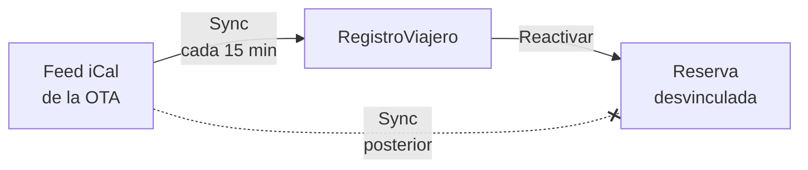

# Reactivar una reserva cancelada

Si una reserva se cancela por error — por ti, por una sincronización iCal de una OTA o por una anulación al Ministerio — puedes **reactivarla** sin tener que crearla de nuevo.

## Cuándo usar Reactivar

- La OTA canceló una reserva por un fallo y el huésped sí va a alojarse.
- Cancelaste manualmente una reserva por error y el huésped llega esa noche.
- Tras una anulación al Ministerio, vas a empezar de cero con datos corregidos.

## Cómo reactivar

1. Abre la reserva cancelada (en el listado de **Reservas** filtra por estado **Cancelado**).
2. Pulsa **Reactivar**.
3. La reserva vuelve a un estado activo:
   - **Pendiente** si aún faltan datos de huéspedes.
   - **Completado por huéspedes** si los huéspedes ya habían firmado todo antes de la cancelación.

## Qué pasa con el feed iCal

Si la reserva venía importada de un calendario iCal (Booking, Airbnb, etc.) y el siguiente sync detectaría que sigue cancelada en la OTA, **RegistroViajero la desvincularía** otra vez automáticamente.

Para evitar ese círculo, **al reactivar se rompe el vínculo** con el feed iCal de origen:

- La reserva mantiene una nota visible de su origen (Booking, Airbnb, etc.) para tu referencia.
- Pero los siguientes syncs **ya no la afectan** — ni se vuelve a cancelar ni se actualiza con cambios de fechas.
- A partir de ese momento la reserva es completamente manual: si cambian las fechas en la OTA, tienes que actualizarlas tú a mano.

::: warning
Si la cancelación viene de una **anulación enviada al Ministerio**, reactivar la reserva en RegistroViajero **no la reactiva en el Ministerio**. Tendrás que enviar una nueva comunicación con los datos corregidos.
:::

## Después de reactivar

Una vez reactivada:

- El interruptor de **edición del huésped** vuelve a su valor por defecto según el [estado](/referencia/estados).
- Las firmas previas de los huéspedes se conservan si la reserva pasó a **Completado por huéspedes**.
- Si la reactivas en **Pendiente**, los huéspedes pueden volver a editar sus datos.

Más detalle en [Estados de reserva](/referencia/estados).
