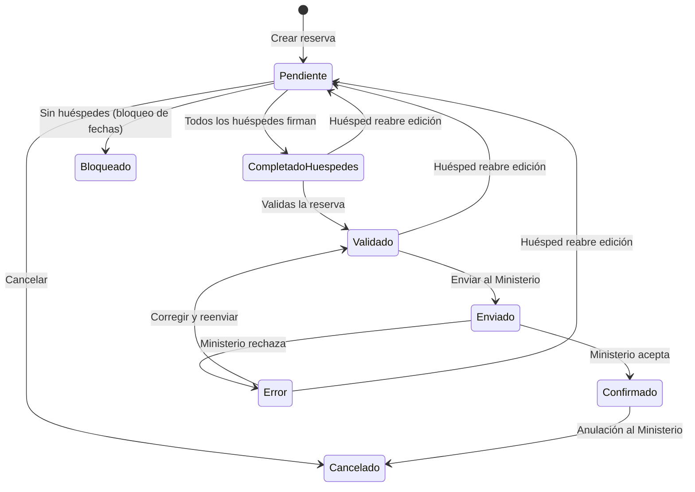

# Estados de reserva

Cada reserva pasa por una serie de estados que reflejan su progreso desde la creación hasta la confirmación por el Ministerio. Aparte del estado, existe un interruptor independiente — la **edición del huésped** — que controla si los huéspedes pueden modificar sus datos.

## Diagrama de estados

## Estados de la reserva

| Estado | Descripción |
|--------|-------------|
| **Pendiente** | Reserva creada. Esperando a que los huéspedes completen sus datos. |
| **Completado por huéspedes** | Todos los huéspedes han rellenado y firmado. Lista para que la valides. |
| **Validado** | Has revisado los datos. Lista para enviar al Ministerio. |
| **Enviado** | La comunicación se ha enviado a SES.HOSPEDAJES. Pendiente de respuesta. |
| **Confirmado** | El Ministerio ha aceptado la comunicación. |
| **Error** | El Ministerio ha rechazado la comunicación. Ver [errores SES](/referencia/errores-ses). |
| **Cancelado** | La reserva se ha anulado (manualmente, desde iCal, o tras una anulación al Ministerio). |
| **Bloqueado** | Bloqueo de fechas sin huéspedes (mantenimiento, uso personal, etc.). |

## Estados del huésped

Cada huésped individual tiene su propio estado:

| Estado | Descripción |
|--------|-------------|
| **Pendiente** | Enlace generado, aún no abierto. |
| **Enlace abierto** | El huésped ha abierto el enlace al menos una vez. |
| **En progreso** | El huésped ha empezado a rellenar y guardado al menos un paso. |
| **Completado** | El huésped ha completado todos los pasos y firmado. |

La reserva pasa a **Completado por huéspedes** cuando **todos** los huéspedes alcanzan el estado **Completado**.

## Bloqueo de la reserva

Estados en los que la reserva es **inmutable** — no se pueden añadir ni quitar huéspedes y no se pueden cambiar las fechas:

- **Enviado**
- **Confirmado**
- **Cancelado**
- **Bloqueado**

En **Pendiente**, **Completado por huéspedes**, **Validado** y **Error** la reserva sigue siendo modificable.

## Bloqueo de edición del huésped

Independientemente del estado de la reserva, hay un interruptor que controla si los huéspedes pueden editar sus datos:

| Estado | Edición del huésped por defecto |
|---|---|
| **Pendiente** | Abierta (los huéspedes pueden editar) |
| **Completado por huéspedes** | Abierta |
| **Validado** | Bloqueada |
| **Error** | Bloqueada |
| **Enviado** | Bloqueada |
| **Confirmado** | Bloqueada |
| **Cancelado** | Bloqueada |
| **Bloqueado** | Bloqueada |

### Desbloqueo manual

Solo en **Validado** y **Error** puedes desbloquear la edición del huésped con un clic, sin enviar una anulación al Ministerio. Es la forma más rápida de corregir errores que el Ministerio te ha devuelto.

Cuando un huésped pulsa **Editar mis datos**, la reserva vuelve a **Pendiente** automáticamente.

En el resto de estados (**Enviado**, **Confirmado**, **Cancelado**, **Bloqueado**) el interruptor no se puede tocar — la única forma de modificar los datos es enviar primero una anulación al Ministerio.

Más detalle en [Desbloquear edición del huésped](/guia/desbloquear-edicion-huesped).
